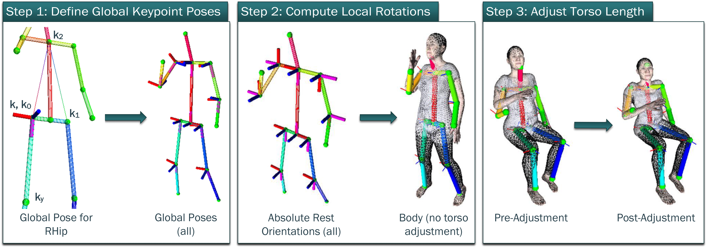

# smg-smplx



This Python package provides a wrapper around relevant bits of SMPL-X. It also includes our method for fitting an SMPL body model to a 3D skeleton.

It is a submodule of [smglib](https://github.com/sgolodetz/smglib), the open-source Python framework associated with our drone research in the [Cyber-Physical Systems](https://www.cs.ox.ac.uk/activities/cyberphysical/) group at the University of Oxford.

### Installation (as part of smglib)

Note: Please read the [top-level README](https://github.com/sgolodetz/smglib/blob/master/README.md) for smglib before following these instructions.

1. Open the terminal, and change to the `<root>/smg-smplx` directory.

2. Check out the `master` branch.

3. Activate the Conda environment, e.g. `conda activate smglib`.

4. If you haven't already installed PyTorch, install it now. In our case, we did this via:

   ```
   pip install https://download.pytorch.org/whl/cu111/torch-1.9.1%2Bcu111-cp37-cp37m-win_amd64.whl
   pip install https://download.pytorch.org/whl/torchaudio-0.9.1-cp37-cp37m-win_amd64.whl
   pip install https://download.pytorch.org/whl/cu111/torchvision-0.10.1%2Bcu111-cp37-cp37m-win_amd64.whl
   ```

   However, you may need a different version of PyTorch for your system, so change this as needed. (In particular, the latest version will generally be ok.)

5. Run `pip install -e .` at the terminal.

6. Set up the data directory:

   i. Clone our fork of SMPL-X into `C:/smplx`, e.g.

   ```
   git clone git@github.com:sgolodetz/smplx.git C:/smplx
   ```

   Note: If you use a directory other than `C:/smplx`, you'll need to change the paths below.

   ii. Set (at a system level) the `SMGLIB_SMPLX_DIR` environment variable to point to `C:/smplx`.

   iii. Obtain the `SMPL_MALE.pkl` and `SMPL_FEMALE.pkl` files from [here](https://smpl.is.tue.mpg.de) (you'll need to register), and put them in `C:/smplx/models/smpl`.

   iv. Obtain the [SURREAL](https://github.com/gulvarol/surreal) textures and put them in the `C:/smplx/textures/smpl/surreal` directory. For reference, the files you need are listed [here](https://github.com/gulvarol/surreal/blob/master/download/files/files_smpl_data.txt), but you'll need to register to access them.

### Publications

If you build on this framework for your research, please cite the following paper:
```
@inproceedings{Golodetz2022TR,
author = {Stuart Golodetz and Madhu Vankadari* and Aluna Everitt* and Sangyun Shin* and Andrew Markham and Niki Trigoni},
title = {{Real-Time Hybrid Mapping of Populated Indoor Scenes using a Low-Cost Monocular UAV}},
booktitle = {IEEE/RSJ International Conference on Intelligent Robots and Systems (IROS)},
month = {October},
year = {2022}
}
```

### Acknowledgements

This work was supported by Amazon Web Services via the [Oxford-Singapore Human-Machine Collaboration Programme](https://www.mpls.ox.ac.uk/innovation-and-business-partnerships/human-machine-collaboration/human-machine-collaboration-programme-oxford-research-pillar), and by UKRI as part of the [ACE-OPS](https://gtr.ukri.org/projects?ref=EP%2FS030832%2F1) grant. We would also like to thank [Graham Taylor](https://www.biology.ox.ac.uk/people/professor-graham-taylor) for the use of the Wytham Flight Lab, [Philip Torr](https://eng.ox.ac.uk/people/philip-torr/) for the use of an Asus ZenFone AR, and [Tommaso Cavallari](https://uk.linkedin.com/in/tcavallari) for implementing TangoCapture.
